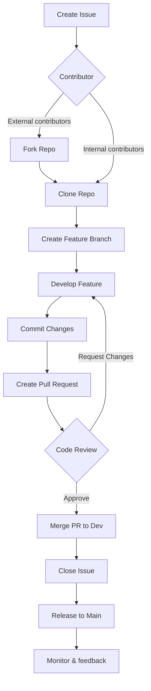

<!-- SPDX-License-Identifier: Apache-2.0 -->

# Contribution Guide <!-- omit in toc -->

#### Table of Contents <!-- omit in toc -->

- [Welcome to the community](#welcome-to-the-community)
  - [Overview of the project](#overview-of-the-project)
  - [About this guide](#about-this-guide)
    - [Helping with this guide](#helping-with-this-guide)
  - [New to Open Source Software (OSS)](#new-to-open-source-software-oss)
  - [How to contribute](#how-to-contribute)
  - [Understanding the project structure](#understanding-the-project-structure)
  - [Finding something to work on](#finding-something-to-work-on)
  - [How to engage](#how-to-engage)
- [Community and governance](#community-and-governance)
    - [Adherence to Linux Foundation's Code of Conduct](#adherence-to-linux-foundations-code-of-conduct)
- [Tazama product overview](#tazama-product-overview)
- [Guides for each persona](#guides-for-each-persona)
  - [For Everyone](#for-everyone)
  - [For Developers](#for-developers)
    - [For contributing code](#for-contributing-code)
        - [Typescript](#typescript)
        - [Python](#python)
    - [For contributing documentation](#for-contributing-documentation)
    - [For contributing tests](#for-contributing-tests)
  - [For Document Writers](#for-document-writers)
  - [For DevOps Engineers](#for-devops-engineers)
  - [For QA Analysts/ Testers](#for-qa-analysts-testers)

## Welcome to the community
Hello and welcome! If you are reading this, we hope it's because you'd like to help. Thank you in advance for your contribution!

### Overview of the project
Tazama is an open source software (OSS) real-time <<-insert your use case here->> monitoring solution. In its initial incarnation Tazama is focused on transaction monitoring for the detection of Fraud and Money Laundering behavior. That's right: an **Open Source** transaction monitoring solution.

We built an open source product so that it can be used to promote trust in digital payments systems and encourage previously under-serviced communities to participate in digital payments ecosystems without worrying about the safety of their money. The product was envisaged by the [Level One Project](https://www.leveloneproject.org), an initiative of the Bill & Melinda Gates Foundation.

While Tazama has strong applications in the financial services industry, it can also be used in other ways. The system could ingest any kind of data in real-time and model behavior over time based on rules and scenarios specific to that data. Tazama could have applications in Healthcare Monitoring, Cybersecurity, Supply Chain Management, Smart City Applications, Retail and Customer Behavior Analysis, Transportation and Logistics, Environmental Monitoring, Telecommunications, IoT Devices and Smart Environments. (We asked ChatGPT.)

We are privileged, and very excited, to have recently joined The Linux Foundation as one of their many excellent Projects.

### About this guide 
This contribution guide will take you through the steps to contribute to the Tazama Project and to help your contributions be successfully integrated into the Product.

We'll cover our code of conduct for healthy community participation, and then walk you through everything you need to be able to contribute in the way you would like. The contribution guide is structured around contributor personas (Developers; Document writers; QA/ testers; DevOps engineers, Project managers and scrum masters)

#### Helping with this guide

We have established a Tazama Contribution Guide Working Group for the purposes of expanding and improving this contribution guide.  Review our [miro board](https://miro.com/welcomeonboard/U2R1K3c5b3dqT2RwclhYcFhMd3BkWVRVVGRESDRhS2ZZZ2JLdW14aGcwTDdUY0d2SU9qQmJaOFJ5RHRUT3RSUWpncXdyUW5wVmU0OTRGeTJzbTBJZjJhcjYrSEJadHBtTEhUeGEvdFV2b0kvc3I5eGI4dTZyME1GTm1YZjFYcmJQdGo1ZEV3bUdPQWRZUHQzSGl6V2NBPT0hdjE=?share_link_id=687611079372) for an overview of the process for providing input to our contribution guide and for an outline of content ideas and areas for improvement. 

### New to Open Source Software (OSS)

  
Are you new to open source software?

Entering the world of open source can be both exciting and rewarding. Open source software (OSS) is software whose source code is freely available for anyone to view, modify, and distribute. This collaborative approach fosters innovation, transparency, and community-driven development.

**Importance of contributions**
We believe that through the collective expertise and efforts of our community and the broad, collaborative approach inherent in open source software development, we can change the world in ways that we would never be able to by ourselves.

Our product is young; barely out of infancy. We need the help of our fledgling community, people like you, to help Tazama grow. While we do need help with some specific things, any help offered is welcome, and we hope to be able to afford everyone in our community an opportunity to be involved in a way that also meets their personal aspirations.

Some of those specific areas where we would particularly appreciate help:

 - Code contributions: Fix bugs, add new features, or improve existing code
 - Documentation: Enhance project documentation to help others understand and use the software effectively
 - Testing: Identify and report bugs, ensuring the software functions as intended
 - Hunting and squashing bugs in our code, our processes and our documentation
 - Implementing Tazama for yourself or others
 - Creating tutorials and how-to guides
 - Give a "thumbs up" on issues that are relevant to you
 - Industry knowledge and experience
 - Community Support: Assist others by answering questions and mentoring newcomers

**Why contribute to Open Source?**
Contributing to open source projects offers numerous benefits:

- Enhance Your Skills: Engaging with OSS allows you to improve your coding abilities, learn new technologies, and understand real-world software development practices
- Build a Professional Network: Collaborating with a global community helps you connect with like-minded individuals, opening doors to mentorship and career opportunities
- Give Back to the Community: By contributing, you help improve software that others rely on, fostering a spirit of collaboration and shared growth
- Gain Recognition: Active contributions can showcase your expertise and commitment, enhancing your professional profile

Additional reading on Open Source <https://opensource.guide/>

<a href="#top">Top</a>

### How to contribute

**Types of contributors**
Our contribution guide addresses different kinds of contributors. It is not intended to be an exhaustive or exclusive list, but the classification of contributors helps us to support each contributor according to their specific needs. 

 - You are an ***Individual Contributor*** if you are exploring and using our product in an individual, unaffiliated capacity, and you want to contribute to the product for its, or your, own sake.
 - You are a ***System Integrator*** if you want to implement the product for your customers, either as a standalone product or as part of your adjacent products, and you'd like to contribute to the product because you are introducing new features that would benefit the product or other users as well.
 - You are a ***Commercial End User*** if you want to implement the product for yourself directly or in partnership with a System Integrator and you are implementing new features that you think would benefit the product or other users as well.
 - You are a ***Big Tech Organization*** or ***Charitable Organization*** who wants to contribute to the product in pursuit of [Digital Public Goods](https://digitalpublicgoods.net/) objectives.

For the most part, because we are an open source software product, we expect that contributors would want to contribute `code`, or documentation on the `code`, and this guide would be focused on helping you to do that.

**Getting started**
 - Understand the Project: Read the project's README and CONTRIBUTING files to grasp its purpose, structure, and contribution guidelines
 - Engage with the Community: Join discussions, forums, or chat channels to connect with other contributors and ask questions
 - Start Small: Begin with minor contributions like fixing typos or addressing small bugs to build confidence and familiarity with the contribution process
 - Learn the Tools: Familiarize yourself with version control systems like Git and platforms like GitHub, which are commonly used in OSS development

Remember, every contribution, no matter how small, makes a difference. The open source community values collaboration, respect, and inclusivity. Don't hesitate to seek guidance and ask questions as you embark on your open source journey.

<a href="#top">Top</a>

**Contribution process overview**

<a href="#top">Top</a>

### Understanding the project structure
Read the [Product Overview](https://github.com/tazama-lf/docs) for a detailed overview of the software.

The Project organization on GitHub contains both PUBLIC and PRIVATE repositories. Core components of the system are in public repositories that are accessible to anyone:

 - The Transaction Monitoring Service (TMS) API
 - The Event Director (ED)
 - The Rule Executor (the rule processor wrapper function)
 - Rule 901, a sample rule
 - The Typology Processor
 - The Transaction Aggregation and Decisioning Processor (TADProc)

... and various library and supporting repositories and tools.

All of our pre-fabricated rule processors, along with their unit tests and default configurations, are hosted in private repositories. That is not to say that they are not also open source software, but we are hosting them in private repositories because they might allow fraudsters and money launderers to reverse engineer the way the system detects fraud and money laundering "out of the box". Any member of our GitHub organization can access the private repositories to implement and work on the rule processors or their tests.

### Finding something to work on
There are many ways to contribute to an open-source software project such as Tazama. Tazama is constantly under development as our community works to improve the software. When we encounter tasks that we think might be a good first issue for someone new to the project to undertake, we create the issue in the [`/tazama-project`](https://github.com/frmscoe/tazama-project) repository and tag it with the label: "good first issue". You can click on the [good first issue](https://github.com/frmscoe/tazama-project/issues?q=is%3Aissue+is%3Aopen+label%3A%22good+first+issue%22) label to display all the current issues under this label.

If there are currently no issues under this label, feel free to explore the project on your own and identify possible fixes or enhancements. Make sure to submit your feature or bug fix request to the `/tazama-project` repository as a new issue for consideration by the team. It would be good to reach out to us to discuss your issue before you start though, just in case it's something we have already considered.

<a href="#top">Top</a>

### How to engage

 - Start a chat in a [Tazama slack channels](slack.tazama.org) such as #welcome or #get-help
 - Start a [discussion](https://github.com/tazama-lf/tazama-project/discussions) in the tazama-project repository
 - Send an email to support@tazama.org

*Placeholder: Reporting bugs*

Create a new issue in the [tazama-project repository](https://github.com/tazama-lf/tazama-project/issues)

*Placeholder: FAQ*

## Community and governance 

[Our open source philosophy](https://github.com/tazama-lf/docs/blob/dev/Guides/tazama-design-principles.md#1-open-source-first)

#### Adherence to Linux Foundation's Code of Conduct
Our Project subscribes to the Linux Foundation's Code of Conduct as represented in the Linux Kernel Code of Conduct. The Linux Kernel Code of Conduct is itself derived from the Contributor Covenant v1.4. Our Code of Conduct is based on v2.1, the most recent version at the time of writing.

In an effort to keep the contribution guide focused and lean, our Code of Conduct is hosted on its own separate page: [Tazama Code of Conduct](/CODE_OF_CONDUCT.md).

References:
[Linux Kernel Code of Conduct](https://docs.kernel.org/process/code-of-conduct.html)
[Contributor Covenant](https://www.contributor-covenant.org/)

*Placeholder: Community roles*

<a href="#top">Top</a>

## Tazama product overview
*Placeholder: Overview of Tazama components*
*Placeholder: Technology stack overview*
*Placeholder: Product vision/Roadmap*
[Tazama design principles](https://github.com/tazama-lf/docs/blob/dev/Guides/tazama-design-principles.md)

<a href="#top">Top</a>

## Guides for each persona

### For Everyone
[Licensing and Contributor Agreements](https://github.com/tazama-lf/docs/blob/dev/Guides/licensing.md)

**General contribution standards/guidelines**
[Definition of done](https://github.com/tazama-lf/docs/blob/dev/Guides/definition-of-done.md)
[Committing your changes](https://github.com/tazama-lf/docs/blob/dev/Guides/committing-changes.md)

*Placeholder: Submitting a PR*
*Placeholder: Code review process*
*Placeholder: Release management process*

**Creating GitHub issues**
*Placeholder: Reporting bugs and proposing features*

<a href="#top">Top</a>

### For Developers

#### For contributing code

###### Typescript
[Required technical skills and knowledge](https://github.com/tazama-lf/docs/blob/dev/Guides/skills-and-knowledge.md)
[Setting Up the development environment](https://github.com/tazama-lf/docs/blob/dev/Guides/dev-set-up-environment.md)
[Tazama coding practices](https://github.com/tazama-lf/docs/blob/dev/Guides/dev-coding-practices.md)

*Placeholder: Guide for building a new rule processor*
*Placeholder: Recommended tools*
*Placeholder: Coding templates*
*Placeholder: Tutorials*

###### Python
*Placeholder: Coding Practices*

#### For contributing documentation
*Placeholder: Technical documentation guidelines*

#### For contributing tests
*Placeholder: Test coverage guidelines*

<a href="#top">Top</a>

### For Document Writers
[Documentation style guide](https://github.com/tazama-lf/docs/blob/dev/Guides/docs-style-guide.md)
[Guide for including diagrams in markdown files](https://github.com/tazama-lf/docs/blob/dev/Guides/drawio-guide.md)
*Placeholder: Markdown recommended practices*
*Placeholder: Tools and setup : VScode with extensions*
*Placeholder: How to contribute Whitepapers, Case Studies*

<a href="#top">Top</a>

### For DevOps Engineers
*Placeholder: Contribution process*
*Placeholder: Contribution areas: CI/CD pipelines, Helm Charts*
*Placeholder: CI/CD pipeline structure: GitHub Actions; Jenkins*
*Placeholder: Infrastructure Automation: Docker, Kubernetes*
*Placeholder: CI/CD pipeline structure: GitHub Actions; Jenkins*
*Placeholder: Tools*

<a href="#top">Top</a>

### For QA Analysts/ Testers
*Placeholder: End-to-end testing process*
*Placeholder: Contribution types: Test cases, unit tests, E2E tests, automation scripts*
*Placeholder: Testing tools: Jest, Postman, Newman*
*Placeholder: Testing standards: Unit test coverage*
*Placeholder: Contribution process: Writing and submitting test cases*
*Placeholder: Testing standards*
*Placeholder: Tools*

<a href="#top">Top</a>

